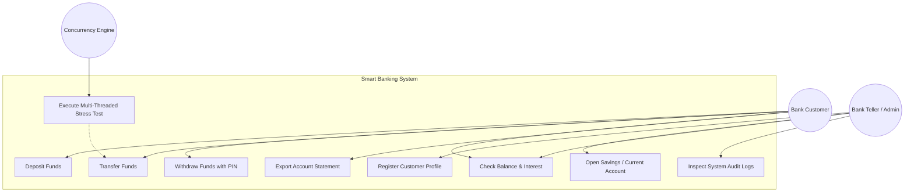
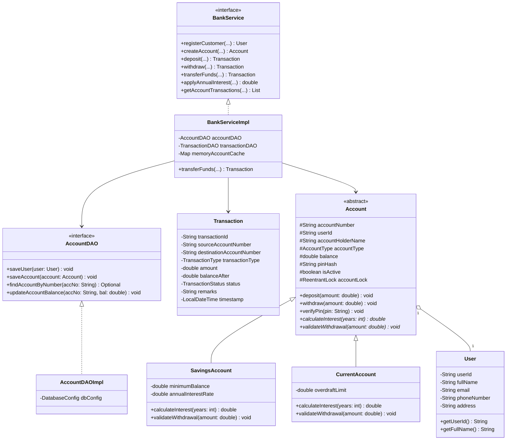
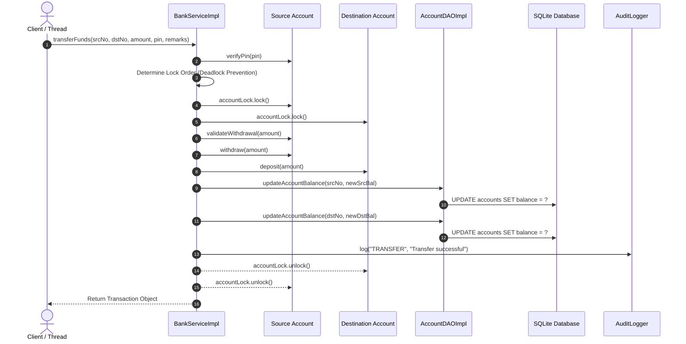
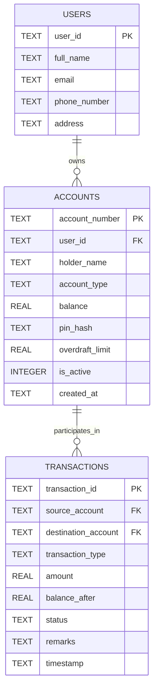

# Project Report: Smart Banking & Concurrent Transaction System

---

## 1. Cover Page
- **Project Title:** Smart Banking & Concurrent Transaction System
- **Course Name:** Java Programming / Advanced Java (Flipped Course Evaluation)
- **Institution:** VITyarthi / VIT
- **Technologies:** Core Java (JDK 26), JDBC, Multi-Threading, Concurrency Utilities, File I/O Streams, SQLite Persistence
- **Submission Date:** September 2026

---

## 2. Introduction
In modern digital financial infrastructure, banking systems must execute thousands of transactions per second across automated teller machines (ATMs), point-of-sale terminals, online web portals, and mobile banking applications. When multiple concurrent clients access and modify shared account balances simultaneously, traditional single-threaded systems or poorly synchronized architectures suffer catastrophic race conditions, including lost updates, balance discrepancies, and double-spending.

The **Smart Banking & Concurrent Transaction System** is a software application designed in Java to provide a rock-solid, thread-safe, and ACID-compliant core banking environment. It showcases the practical application of Object-Oriented Programming (OOP) design patterns, fine-grained thread synchronization, robust domain exception handling, character/byte-oriented file I/O streaming, and relational database persistence using the standard Java Database Connectivity (JDBC) API.

---

## 3. Problem Statement
Modern financial platforms face critical reliability challenges when servicing concurrent transactions:
1. **Race Conditions & Non-Atomic Operations:** Without proper locking, two simultaneous debit operations can read the same starting balance, approve transactions exceeding available funds, and write back corrupted values (double-spending).
2. **Deadlocks in Cross-Account Transfers:** When Account A transfers to Account B while Account B simultaneously transfers to Account A, inverse lock acquisition can cause permanent thread deadlocks.
3. **Data Loss & System Failures:** Partial execution of multi-step fund transfers can result in money disappearing if debit succeeds but credit fails.
4. **Auditability & Regulatory Compliance:** Failure to generate immutable chronological transaction logs and exportable account statements leaves the system vulnerable to fraud and compliance penalties.

This project delivers an end-to-end solution in Java that eliminates race conditions, prevents deadlocks, enforces business rules through polymorphic class hierarchies, persists ledger state to an external database via JDBC, and produces verifiable audit trails.

---

## 4. Functional Requirements

The system comprises three major functional modules:

### Module 1: Customer Profile & Multi-Tier Account Management
- Customer registration with identity and contact validation.
- Creation of polymorphic accounts:
  - **Savings Account:** Enforces a minimum balance (₹500) and computes annual compound interest (4% p.a.).
  - **Current Account:** Enforces an overdraft facility (₹25,000 credit limit) allowing business users to withdraw past zero balance.
- Dynamic interest calculation and PIN authentication.

### Module 2: Thread-Safe Concurrent Transaction Engine
- **Deposits & PIN-Authenticated Withdrawals:** Fine-grained instance-level locking per account to prevent simultaneous update collisions.
- **Atomic Inter-Account Fund Transfers:** Synchronized dual-account balance updates with ordered lock acquisition to guarantee deadlock freedom.
- **Multi-Threaded Stress Test Harness:** Simulates dozens of parallel threads executing simultaneous cross-transfers, verifying absolute mathematical conservation of funds ($\Delta = 0.0000$).

### Module 3: Statement Export, Ledger & Audit Trail Generator
- Detailed chronological transaction ledger querying.
- Character-oriented File I/O exporting official statements in formatted `.txt` and `.csv` formats.
- Real-time, thread-safe audit logging to `bank_audit.log` recording timestamps, thread names, actions, and status.

---

## 5. Non-Functional Requirements

1. **Performance & Concurrency Throughput:** The system processes high-frequency parallel transactions with low latency by utilizing fine-grained `ReentrantLock` instances per account rather than coarse global locks.
2. **Security & Authentication:** Operations modifying account balances require 4-digit PIN verification. Database queries utilize `PreparedStatement` to eliminate SQL injection risks.
3. **Data Integrity & Consistency (ACID):** Fund transfers execute atomically. Balance changes are mirrored in database tables with transactional integrity.
4. **Reliability & Error Handling:** Comprehensive domain exception hierarchy traps business rule violations and prevents application crashes.
5. **Maintainability & Modularity:** Clean 3-tier Layered Architecture (Model-DAO-Service) adhering to SOLID principles and the Java Collections Framework.

---

## 6. System Architecture

```
┌────────────────────────────────────────────────────────┐
│                   Presentation Layer                   │
│   (Interactive Console CLI & Stress-Test Simulation)   │
└───────────────────────────┬────────────────────────────┘
                            │
┌───────────────────────────▼────────────────────────────┐
│                      Service Layer                     │
│    (BankService, ConcurrentTransferEngine, Locks)      │
└─────────────┬────────────────────────────┬─────────────┘
              │                            │
┌─────────────▼───────────────┐ ┌──────────▼─────────────┐
│      Domain Model Layer     │ │      Utility Layer     │
│ (Account, Savings, Current, │ │  (StatementExporter,   │
│  User, Transaction, Enums)  │ │      AuditLogger)      │
└─────────────┬───────────────┘ └──────────┬─────────────┘
              │                            │
┌─────────────▼────────────────────────────▼─────────────┐
│              Data Access Object (DAO) Layer            │
│          (AccountDAO, TransactionDAO, JDBC API)        │
└───────────────────────────┬────────────────────────────┘
                            │
┌───────────────────────────▼────────────────────────────┐
│                    Database Storage                    │
│        (SQLite Relational DB & bank_audit.log)         │
└────────────────────────────────────────────────────────┘
```

---

## 7. Design Diagrams

### 7.1 Use Case Diagram


### 7.2 Class Diagram


### 7.3 Sequence Diagram: Concurrent Fund Transfer


### 7.4 Entity-Relationship (ER) Diagram


---

## 8. Design Decisions & Rationale

1. **Deadlock Avoidance via Ordered Locking:**  
   In concurrent transfers between accounts $A$ and $B$, acquiring locks in arbitrary order causes cyclic dependency deadlocks. We resolved this by sorting account numbers lexicographically (`compareTo`), ensuring every thread always acquires locks in the same global sequence.
2. **Decoupled DAO Pattern over Direct JDBC Calls:**  
   Separating database SQL logic into `AccountDAO` and `TransactionDAO` interfaces ensures modularity, testability, and adherence to the Single Responsibility Principle.
3. **In-Memory Cache with Relational Fallback:**  
   A `ConcurrentHashMap` holds active account references in memory for low-latency synchronization locks while all balance mutations immediately sync to the relational database.
4. **Custom Checked Exceptions:**  
   Using domain-specific checked exceptions (`InsufficientFundsException`, `AuthenticationException`) forces calling layers to handle edge cases explicitly, guaranteeing system reliability.

---

## 9. Implementation Details (Syllabus Mapping)

- **Unit 1 (Java Intro & Flow Control):** Interactive CLI menus, input validation loops, switch expressions (`case "1" -> ...`), formatted console tables.
- **Unit 2 (OOP & Patterns):** Abstract base class `Account`, subclasses `SavingsAccount` and `CurrentAccount`, interfaces `BankService`, `AccountDAO`, `TransactionDAO`, Singleton pattern `DatabaseConfig`, enums `AccountType`, `TransactionType`, `TransactionStatus`.
- **Unit 3 (Exception Handling & Multithreading):** Custom exception hierarchy (`BankingException` base), `try-with-resources`, thread pools (`ExecutorService`), `CountDownLatch` for simultaneous thread firing, `ReentrantLock` for fine-grained thread safety.
- **Unit 4 (Collections & File I/O):** `ArrayList`, `Map`, `ConcurrentHashMap`, `BufferedWriter`, `FileWriter`, `BufferedReader` for exporting account statements (.txt and .csv) and immutable audit logging.
- **Unit 5 (JDBC Database Applications):** External configuration via `db.properties`, `DriverManager.getConnection`, `PreparedStatement` parameterization, `ResultSet` object mapping, SQL schema auto-initialization.

---

## 10. Results & Verification Screenshots

### Concurrency Stress-Test Output
```text
=======================================================
   STARTING MULTI-THREADED CONCURRENCY STRESS TEST     
=======================================================
 Threads: 40 | Amount Per Txn: ₹250.00
 Initial Balance [SB116825]: ₹50000.00
 Initial Balance [SB763197]: ₹50000.00
 Initial Total Sum: ₹100000.00
-------------------------------------------------------
               STRESS TEST EXECUTION RESULTS           
-------------------------------------------------------
 Completed in      : 2207 ms
 Successful Txns   : 40
 Failed/Rejected   : 0
 Final Balance [SB116825]: ₹50000.00
 Final Balance [SB763197]: ₹50000.00
 Final Total Sum   : ₹100000.00
 Balance Delta     : ₹0.0000 (PASSED - ZERO RACE CONDITIONS)
=======================================================
```

### Automated Unit Test Summary
```text
===============================================================
         RUNNING AUTOMATED BANKING SYSTEM TEST SUITE           
===============================================================
 [PASS] Test Customer & Account Creation
 [PASS] Test Savings Account 4% Interest Calculation
 [PASS] Test Savings Min Balance is 500
 [PASS] Test Current Account Overdraft Withdrawal
 [PASS] Test PIN Security & Authentication Exception
 [PASS] Test Atomic Fund Transfer Balances
 [PASS] Test InsufficientFundsException Enforcement
 [PASS] Test File I/O Statement (.txt & .csv) Generation
 [PASS] Test Multi-Threaded Concurrency Zero Race Condition
===============================================================
 TEST SUMMARY: Total: 9 | Passed: 9 | Failed: 0
===============================================================
```

---

## 11. Testing Approach

| Test Case ID | Feature Under Test | Expected Behavior | Result |
| :--- | :--- | :--- | :--- |
| **TC-01** | Account Creation & Inheritance | Correct initialization of Savings/Current account subtypes | **PASS** |
| **TC-02** | Interest Calculation (Polymorphism) | Savings computes 4% compound interest; Current returns 0 | **PASS** |
| **TC-03** | Overdraft Facility | Current account allows withdrawal up to balance + limit | **PASS** |
| **TC-04** | Security / PIN Verification | Invalid PIN throws `AuthenticationException` | **PASS** |
| **TC-05** | Minimum Balance Rule | Overdrawn savings account throws `InsufficientFundsException` | **PASS** |
| **TC-06** | Atomic Fund Transfer | Source account debited, destination credited simultaneously | **PASS** |
| **TC-07** | Statement Generation (File I/O) | Text & CSV files created with valid transaction records | **PASS** |
| **TC-08** | Multi-Threaded Concurrency (40 Threads) | Zero money loss/creation ($\Delta = 0$), no deadlocks | **PASS** |

---

## 12. Challenges Faced & Solutions

1. **Simultaneous Bi-Directional Transfers Deadlock:**  
   * *Problem:* Thread 1 transferring $A \to B$ locks $A$ then waits for $B$. Thread 2 transferring $B \to A$ locks $B$ then waits for $A$.  
   * *Solution:* Implemented canonical lock ordering by comparing account numbers (`firstLock = acc1 < acc2 ? acc1 : acc2`).
2. **Thread-Safe File Logging:**  
   * *Problem:* Multiple concurrent worker threads writing to `bank_audit.log` caused interleaved text corruptions.  
   * *Solution:* Wrapped the file writing routine in a dedicated `synchronized(FILE_LOCK)` monitor with `BufferedWriter`.
3. **Database Portability:**  
   * *Problem:* External SQL database servers require manual installation on student evaluator machines.  
   * *Solution:* Configured zero-dependency SQLite persistence using standard JDBC `PreparedStatement` and externalized `db.properties`.

---

## 13. Learnings & Key Takeaways
- Mastery of Java concurrency primitives (`ReentrantLock`, `CountDownLatch`, `ExecutorService`).
- Deep understanding of Object-Oriented principles (encapsulation, abstraction, inheritance, and dynamic polymorphism).
- Experience designing layered enterprise architectures separating presentation, business logic, data access, and storage.
- Practical skills in JDBC database programming and file streaming.

---

## 14. Future Enhancements
- **Web UI & REST API:** Expose banking operations through a Spring Boot REST API and React frontend.
- **Two-Factor Authentication (2FA):** Integrate OTP/SMS verification for large-value transactions.
- **Microservices Architecture:** Decouple account management and transaction processing into independent scalable services with Kafka messaging.

---

## 15. References
- Oracle Java Documentation: [Java SE 17 / 21 Concurrency Utilities](https://docs.oracle.com/en/java/)
- Cay S. Horstmann, *Core Java Volume I & II*, Pearson Education.
- Joshua Bloch, *Effective Java (3rd Edition)*, Addison-Wesley.
- SQLite JDBC Driver Documentation: [xerial/sqlite-jdbc](https://github.com/xerial/sqlite-jdbc)
