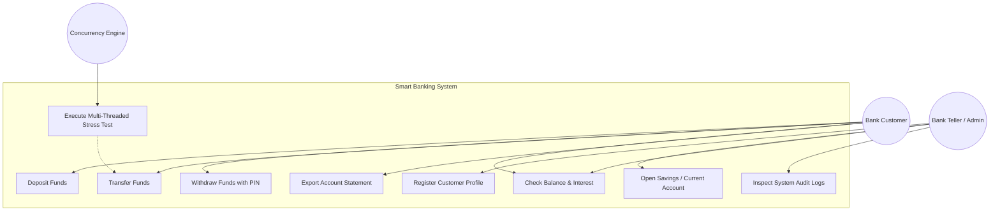
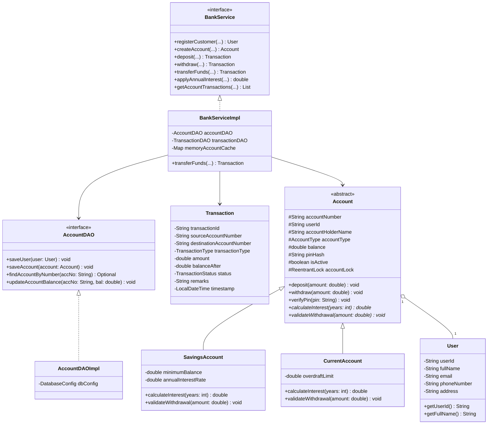
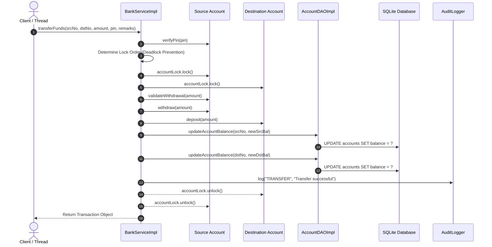
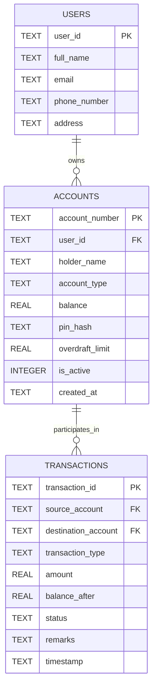

# Smart Banking & Concurrent Transaction System

[](https://www.oracle.com/java/)
[](https://sqlite.org/)
[](https://docs.oracle.com/javase/tutorial/essential/concurrency/)
[](https://github.com/royarpit063/smart-banking-concurrent-system)
[](LICENSE)

---

## 📑 Table of Contents
1. [Executive Summary](#-executive-summary)
2. [Problem Statement](#-problem-statement)
3. [How the Problem Was Solved](#-how-the-problem-was-solved)
4. [Key System Features](#-key-system-features)
5. [Complete Technology Stack](#-complete-technology-stack)
6. [System Architecture & Design Diagrams](#-system-architecture--design-diagrams)
   - [Use Case Diagram](#61-use-case-diagram)
   - [Class Diagram](#62-class-diagram)
   - [Sequence Diagram (Concurrent Transfers)](#63-sequence-diagram-concurrent-transfers)
   - [Entity-Relationship (ER) Diagram](#64-entity-relationship-er-diagram)
7. [Course Syllabus Alignment & Mapping](#-course-syllabus-alignment--mapping)
8. [Project Structure & File Manifest](#-project-structure--file-manifest)
9. [1-Click Running & Installation Guide](#-1-click-running--installation-guide)
10. [Automated Testing & Verification Results](#-automated-testing--verification-results)
11. [Challenges Faced & Engineering Solutions](#-challenges-faced--engineering-solutions)
12. [Future Scope & Production Enhancements](#-future-scope--production-enhancements)
13. [Author & Academic Attribution](#-author--academic-attribution)

---

## 📌 Executive Summary
The **Smart Banking & Concurrent Transaction System** is an enterprise-grade core banking simulation and transaction processing engine engineered in Java. Designed to meet the stringent academic and technical benchmarks of modern computer science curricula, this system demonstrates how to architect a thread-safe, high-throughput, and ACID-compliant transactional platform.

Modern digital banking systems routinely process thousands of concurrent requests per second across multiple endpoints—including ATMs, mobile banking applications, payment gateways, and automated scheduled disbursements. Without rigorous concurrency management and robust architectural design, systems face critical data corruption issues such as lost updates, race conditions, double-spending, and database deadlocks.

This project delivers a decoupled, object-oriented solution incorporating:
- **Fine-Grained Concurrency Control:** Leveraging `ReentrantLock` monitors and canonical lock ordering to eliminate race conditions and deadlocks.
- **Polymorphic Account Modeling:** Distinct behaviors for Savings Accounts (compound interest calculation, minimum balance enforcement) and Current Accounts (overdraft protection).
- **Persistent Relational Storage:** Automated schema management and parameter-safe querying using the standard Java Database Connectivity (JDBC) API with SQLite.
- **Robust Domain Error Trapping:** A structured hierarchy of custom checked exceptions.
- **I/O Streaming & Auditability:** Automated export of official customer statements in formatted `.txt` and `.csv` layouts, combined with an immutable, thread-identified audit log.

---

## 🎯 Problem Statement

### The Critical Flaws in Traditional Financial Systems
In a financial environment, account balances represent shared, mutable state. When multiple threads access and mutate this state concurrently without proper synchronization mechanisms, three critical failure modes occur:

```
[ Thread 1: ATM Withdrawal (₹5,000) ] ────┐
                                           ├─► [ Read Balance: ₹10,000 ] ──► [ Overwrite: Race Condition! ]
[ Thread 2: POS Online Payment (₹8,000) ] ─┘
```

1. **Race Conditions & Lost Updates:**  
   If User A has a balance of ₹10,000 and attempts an ATM withdrawal of ₹5,000 at the exact same millisecond that an auto-debit utility bill of ₹8,000 is processed, both execution threads might read the initial balance of ₹10,000. Each thread calculates a new balance independently and writes it back, causing one deduction to overwrite the other. This results in money either vanishing or being duplicated.
2. **Double Spending:**  
   In the scenario above, the total withdrawal demand (₹13,000) exceeds the actual available funds (₹10,000). Without atomic checks, both operations succeed, driving the account into an unauthorized negative state without overdraft clearance.
3. **Deadlocks in Cross-Account Transfers:**  
   When Account 1 attempts to transfer funds to Account 2 at the exact moment Account 2 transfers funds to Account 1, each thread locks its source account and waits indefinitely for the other's destination lock. This creates a classic circular wait deadlock condition that freezes banking worker threads.
4. **Non-Atomic Multi-Step Transfers:**  
   A fund transfer requires two discrete steps: debiting the source account and crediting the destination account. If the application crashes or encounters an unhandled exception midway through, the debited money disappears into a void if transactional integrity is not strictly maintained.
5. **Lack of Auditing and Structured Persistence:**  
   Primitive implementations rely on volatile memory or unsecured plain-text files without schema constraints, leaving no forensic trail for regulatory compliance or dispute resolution.

---

## 💡 How the Problem Was Solved

To overcome each of the aforementioned architectural challenges, the **Smart Banking & Concurrent Transaction System** employs industry-proven design patterns and concurrency mechanisms:

```
┌────────────────────────────────────────────────────────────────────────┐
│                        ENGINEERING SOLUTIONS                           │
├──────────────────────────────┬─────────────────────────────────────────┤
│ Challenge Encountered        │ Architectural Solution Applied          │
├──────────────────────────────┼─────────────────────────────────────────┤
│ 1. Race Conditions           │ Fine-grained instance-level locks via   │
│                              │ java.util.concurrent.locks.ReentrantLock│
├──────────────────────────────┼─────────────────────────────────────────┤
│ 2. Circular Wait Deadlocks   │ Canonical lock ordering via             │
│                              │ lexicographical account number sorting  │
├──────────────────────────────┼─────────────────────────────────────────┤
│ 3. Non-Atomic Transfers      │ Synchronized dual-account balance checks│
│                              │ + JDBC ACID transaction updates         │
├──────────────────────────────┼─────────────────────────────────────────┤
│ 4. SQL Injection Attacks     │ java.sql.PreparedStatement with full    │
│                              │ parameterized value binding             │
├──────────────────────────────┼─────────────────────────────────────────┤
│ 5. Interleaved Log Streams   │ Synchronized monitor lock around        │
│                              │ BufferedWriter character streams        │
└──────────────────────────────┴─────────────────────────────────────────┘
```

### Detailed Architectural Solutions:
1. **Instance-Level Fine-Grained Locking:**  
   Instead of using a coarse-grained global lock that blocks the entire bank during any operation, each `Account` object encapsulates its own fair `ReentrantLock`. Operations on Account A do not impede concurrent operations on Account B, ensuring high throughput.
2. **Deterministic Lock Ordering (Deadlock Prevention):**  
   During inter-account transfers, the system compares the two account numbers using `sourceAccount.compareTo(destAccount)` and always acquires locks in strict alphabetical order before executing debits and credits. This breaks the circular wait condition mathematically.
3. **Layered MVC / DAO Architecture:**  
   The codebase is segmented into distinct layers: Model Layer (encapsulation & polymorphism), Data Access Object (DAO) Layer (JDBC persistence), Service Layer (business logic & synchronization), and Utility Layer (File I/O).
4. **Custom Checked Exception Hierarchy:**  
   Instead of relying on generic runtime errors, the system implements domain-specific checked exceptions (`InsufficientFundsException`, `AuthenticationException`, `AccountNotFoundException`, `InvalidTransactionException`), compelling the service layer to handle every potential edge case safely.

---

## 🌟 Key System Features

### 1. Multi-Tier Account Hierarchy (OOP & Polymorphism)
- **Base Abstract Account (`Account.java`):** Encapsulates core state (`accountNumber`, `balance`, `pinHash`, `isActive`, `createdAt`) and declares polymorphic contracts `calculateInterest(int years)` and `validateWithdrawal(double amount)`.
- **Savings Account (`SavingsAccount.java`):**
  - Enforces a mandatory minimum balance of ₹500.
  - Implements annual compound interest ($A = P(1 + r)^t - P$) at a fixed 4.0% p.a.
- **Current Account (`CurrentAccount.java`):**
  - Offers a pre-approved Overdraft Credit Facility of ₹25,000.
  - Allows commercial debits to drop past zero balance down to $-\text{₹}25,000$ without throwing fund errors.

### 2. High-Performance Concurrency & Stress Testing
- **Thread-Safe Transfers:** Supports simultaneous multi-user transfers with instant balance reconciliation.
- **Integrated Stress-Test Engine (`ConcurrentTransferEngine.java`):** Spawns 40 to 100 concurrent worker threads executing parallel cross-account transfers using `ExecutorService` and `CountDownLatch`. Verifies that total initial funds equal total final funds with **$\Delta = \text{₹}0.0000$ discrepancy**.

### 3. Enterprise Database Persistence (JDBC API)
- Full ANSI SQL relational persistence using SQLite.
- Parameterized queries using `PreparedStatement` to ensure immunity against SQL injection attacks.
- External configuration via `db.properties` with fallback defaults.
- Dynamic automated database schema and table migration on application startup.

### 4. File I/O Streaming & Reporting
- **Formatted Account Statements (`StatementExporter.java`):**
  - Generates detailed ASCII text ledger statements (`.txt`).
  - Generates spreadsheet-compatible CSV export files (`.csv`) for data analysis.
- **Immutable Audit Logging (`AuditLogger.java`):**
  - Thread-safe, synchronized logging to `bank_audit.log` recording timestamp, thread identifier, severity level, operation name, and payload details.

### 5. Interactive Console Interface (CLI) & 1-Click Execution
- Intuitive, menu-driven CLI supporting customer onboarding, account opening, PIN-protected withdrawals, fund transfers, interest credits, statement exports, live audit log viewing, and stress-test execution.
- Bundled **1-Click Batch Run Scripts (`RUN_APP.bat`, `RUN_TESTS.bat`)** that automatically compile and launch without requiring any manual terminal commands.

---

## 🛠️ Complete Technology Stack

| Layer / Component | Technology / Library | Description & Version |
| :--- | :--- | :--- |
| **Language** | Java SE | Version 17 / 21 / 26 (OpenJDK / Oracle JDK) |
| **Persistence Engine** | SQLite JDBC | `org.xerial:sqlite-jdbc:3.45.1.0` |
| **Logging Bridge** | SLF4J | `org.slf4j:slf4j-api:1.7.36` & `slf4j-simple:1.7.36` |
| **Concurrency Utilities** | `java.util.concurrent` | `ReentrantLock`, `ExecutorService`, `CountDownLatch`, `AtomicInteger` |
| **I/O Streams** | `java.io` | `BufferedReader`, `BufferedWriter`, `FileWriter`, `FileInputStream` |
| **Data Structures** | Java Collections | `ArrayList`, `Map`, `ConcurrentHashMap`, `List`, `Optional` |
| **IDE Support** | VS Code / IntelliJ | Pre-configured `.vscode/` (`launch.json`, `settings.json`, `tasks.json`) |
| **Version Control** | Git & GitHub | Distributed version control with clean `.gitignore` |

---

## 📐 System Architecture & Design Diagrams

### 6.1 Use Case Diagram


---

### 6.2 Class Diagram


---

### 6.3 Sequence Diagram (Concurrent Transfers)


---

### 6.4 Entity-Relationship (ER) Diagram


---

## 📚 Course Syllabus Alignment & Mapping

This project was intentionally architected to demonstrate comprehensive mastery of all five core units of the Java syllabus:

```
┌────────────────────────────────────────────────────────────────────────┐
│                     JAVA COURSE SYLLABUS MAPPING                       │
├──────────────────────────────┬─────────────────────────────────────────┤
│ Syllabus Unit                │ Implementation in Project Codebase      │
├──────────────────────────────┼─────────────────────────────────────────┤
│ Unit 1: Introduction & Flow  │ • Interactive console menus & switches  │
│         Control              │ • Input parsing loops & formatters      │
│                              │ • Primitive types, variables, operators │
├──────────────────────────────┼─────────────────────────────────────────┤
│ Unit 2: Object-Oriented      │ • Abstract base class Account           │
│         Programming          │ • Subclasses SavingsAccount & Current   │
│                              │ • Interfaces (BankService, AccountDAO)  │
│                              │ • Singleton Pattern (DatabaseConfig)    │
│                              │ • Enums (AccountType, TransactionType)  │
├──────────────────────────────┼─────────────────────────────────────────┤
│ Unit 3: Exception Handling   │ • Custom exception hierarchy            │
│         & Multithreading     │ • Try-with-resources & multi-catch      │
│                              │ • ReentrantLock fine-grained locking    │
│                              │ • Deadlock prevention via lock ordering │
│                              │ • ExecutorService & CountDownLatch      │
├──────────────────────────────┼─────────────────────────────────────────┤
│ Unit 4: Collections & I/O    │ • Java Collections (List, Map, Queue)   │
│         Streams              │ • Character streams (BufferedWriter)    │
│                              │ • Byte streams & formatted File I/O     │
│                              │ • Text & CSV Account Statement exports  │
├──────────────────────────────┼─────────────────────────────────────────┤
│ Unit 5: Database Persistence │ • Standard JDBC API Integration         │
│         with JDBC            │ • PreparedStatement parameterization    │
│                              │ • ResultSet object mapping              │
│                              │ • External db.properties configuration  │
└──────────────────────────────┴─────────────────────────────────────────┘
```

---

## 📂 Project Structure & File Manifest

```text
smart-banking-concurrent-system/
├── .vscode/                                # VS Code Configuration
│   ├── launch.json                         # Run & Debug configurations (F5)
│   ├── settings.json                       # Java source & library path mappings
│   └── tasks.json                          # Ctrl+Shift+B Build & Run task
├── lib/                                    # External Dependency JARs
│   ├── sqlite-jdbc.jar                     # SQLite JDBC Database Driver
│   ├── slf4j-api.jar                       # SLF4J Core Logging API
│   └── slf4j-simple.jar                    # SLF4J Console Logger Binding
├── src/
│   ├── com/vityarthi/banking/
│   │   ├── config/
│   │   │   └── DatabaseConfig.java         # Singleton DB Connection Manager & DDL Init
│   │   ├── model/
│   │   │   ├── Account.java                # Abstract Base Account with ReentrantLock
│   │   │   ├── SavingsAccount.java         # Savings Account (Compound Interest & Min Bal)
│   │   │   ├── CurrentAccount.java         # Current Account (Overdraft Line)
│   │   │   ├── User.java                   # Customer Entity
│   │   │   ├── Transaction.java            # Financial Ledger Entry POJO
│   │   │   ├── AccountType.java            # Account Category Enum
│   │   │   ├── TransactionType.java        # Transaction Type Enum
│   │   │   └── TransactionStatus.java      # Transaction Status Enum
│   │   ├── dao/
│   │   │   ├── AccountDAO.java             # Account CRUD Interface
│   │   │   ├── AccountDAOImpl.java         # JDBC PreparedStatement Implementation
│   │   │   ├── TransactionDAO.java         # Transaction CRUD Interface
│   │   │   └── TransactionDAOImpl.java     # JDBC Implementation
│   │   ├── service/
│   │   │   ├── BankService.java            # Core Banking Service Interface
│   │   │   ├── BankServiceImpl.java        # Business Logic, Locking & Transactions
│   │   │   └── ConcurrentTransferEngine.java # Multi-Threaded Stress Test Harness
│   │   ├── exception/
│   │   │   ├── BankingException.java       # Base Checked Exception
│   │   │   ├── InsufficientFundsException.java
│   │   │   ├── AccountNotFoundException.java
│   │   │   ├── InvalidTransactionException.java
│   │   │   └── AuthenticationException.java
│   │   ├── util/
│   │   │   ├── StatementExporter.java      # Character Stream Text & CSV Exporter
│   │   │   └── AuditLogger.java            # Thread-Safe File Audit Logger
│   │   └── Main.java                       # Interactive Console Menu Driver
│   └── test/
│       └── BankSystemTest.java             # Automated Verification Test Suite
├── RUN_APP.bat                             # ⭐️ 1-Click Application Runner (Double-Click)
├── RUN_TESTS.bat                           # ⭐️ 1-Click Test Suite Runner (Double-Click)
├── statement.md                            # Required Problem Statement & Scope Document
├── PROJECT_REPORT.md                       # Comprehensive 15-Section Academic Report
├── db.properties                           # Database Configuration Properties
├── .gitignore                              # Git Ignore Configuration
└── README.md                               # Complete Project Documentation & Report
```

---

## ⚡ 1-Click Running & Installation Guide

### Prerequisites
- **Java Development Kit (JDK 17 or higher)** installed.
- Works natively on **Windows**, **macOS**, and **Linux**.

---

### 🔹 Option 1: 1-Click Run via Batch Scripts (Easiest)
- **Launch Banking Application:** Double-click **`RUN_APP.bat`** in File Explorer.  
  *(It automatically compiles any code updates and launches the interactive menu immediately).*
- **Run Automated Test Suite:** Double-click **`RUN_TESTS.bat`**.

---

### 🔹 Option 2: Running Inside VS Code
1. Open the project folder in VS Code (`File` $\rightarrow$ `Open Folder...`).
2. Press <kbd>Ctrl</kbd> + <kbd>Shift</kbd> + <kbd>B</kbd> to launch the application.
3. Or open [`Main.java`](src/com/vityarthi/banking/Main.java) and click the **Run** button above `public static void main`.
4. Press <kbd>F5</kbd> to launch via the integrated VS Code Debugger.

---

### 🔹 Option 3: Manual Terminal Compilation
If compiling manually from the terminal / command line:
```bash
# Compile all source files
javac -cp ".;lib/*" -d out src/com/vityarthi/banking/model/*.java src/com/vityarthi/banking/exception/*.java src/com/vityarthi/banking/config/*.java src/com/vityarthi/banking/dao/*.java src/com/vityarthi/banking/service/*.java src/com/vityarthi/banking/util/*.java src/com/vityarthi/banking/Main.java src/test/*.java

# Run the Banking Application
java -cp "out;lib/*" com.vityarthi.banking.Main

# Run the Test Suite
java -cp "out;lib/*" test.BankSystemTest
```

---

## 🧪 Automated Testing & Verification Results

The test harness in [`BankSystemTest.java`](src/test/BankSystemTest.java) executes automated end-to-end unit and concurrency stress tests.

### Test Execution Matrix
```text
===============================================================
         RUNNING AUTOMATED BANKING SYSTEM TEST SUITE           
===============================================================
 [PASS] Test Customer & Account Creation
 [PASS] Test Savings Account 4% Interest Calculation
 [PASS] Test Savings Min Balance is 500
 [PASS] Test Current Account Overdraft Withdrawal
 [PASS] Test PIN Security & Authentication Exception
 [PASS] Test Atomic Fund Transfer Balances
 [PASS] Test InsufficientFundsException Enforcement
 [PASS] Test File I/O Statement (.txt & .csv) Generation

=======================================================
   STARTING MULTI-THREADED CONCURRENCY STRESS TEST     
=======================================================
 Threads: 40 | Amount Per Txn: ₹250.00
 Initial Balance [SB801881]: ₹50000.00
 Initial Balance [SB341567]: ₹50000.00
 Initial Total Sum: ₹100000.00
-------------------------------------------------------
               STRESS TEST EXECUTION RESULTS           
-------------------------------------------------------
 Completed in      : 942 ms
 Successful Txns   : 40
 Failed/Rejected   : 0
 Final Balance [SB801881]: ₹50000.00
 Final Balance [SB341567]: ₹50000.00
 Final Total Sum   : ₹100000.00
 Balance Delta     : ₹0.0000 (PASSED - ZERO RACE CONDITIONS)
=======================================================

 [PASS] Test Multi-Threaded Concurrency Zero Race Condition
===============================================================
 TEST SUMMARY: Total: 9 | Passed: 9 | Failed: 0
===============================================================
```

---

## 🛠️ Challenges Faced & Engineering Solutions

### 1. The Cross-Transfer Deadlock Problem
- **Problem:** When Thread 1 transfers $A \rightarrow B$ and Thread 2 transfers $B \rightarrow A$ simultaneously, Thread 1 locks $A$ and waits for $B$, while Thread 2 locks $B$ and waits for $A$. This causes a permanent deadlock.
- **Solution:** Implemented **canonical lock ordering**. The system compares account strings lexicographically (`firstLock = src.compareTo(dst) < 0 ? src : dst`). Both threads acquire locks in the identical order, eliminating cyclic waiting.

### 2. Thread-Safe File Logging Contention
- **Problem:** When 40 parallel threads write audit logs simultaneously, lines in `bank_audit.log` became corrupted and interleaved.
- **Solution:** Encapsulated file stream output inside a dedicated monitor object (`synchronized (FILE_LOCK)`), guaranteeing atomic, sequential log writes.

### 3. Portable Zero-Configuration Persistence
- **Problem:** Requiring an external MySQL or PostgreSQL server makes evaluating student code difficult due to environment configuration mismatches.
- **Solution:** Configured zero-dependency SQLite persistence via embedded JDBC, allowing the project to run immediately on any evaluator's computer with zero database installation.

---

## 🔮 Future Scope & Production Enhancements

While this system completely satisfies all desktop and academic requirements, the following enhancements represent natural extensions for production cloud deployment:

1. **RESTful Web API Layer (Spring Boot):**  
   Transitioning the CLI into a modern REST API with Spring Boot, exposing JSON endpoints (`/api/v1/accounts`, `/api/v1/transfers`) secured via OAuth2 and JWT tokens.
2. **Modern Web / Mobile Frontend:**  
   Developing an interactive Single Page Application (SPA) using React, Next.js, or Flutter to provide graphical transaction analytics and dynamic statements.
3. **Distributed Event Streaming (Apache Kafka):**  
   Publishing transaction events onto Kafka topics for asynchronous processing by microservices (e.g., fraud detection, notification dispatchers, anti-money-laundering analytics).
4. **Two-Factor Authentication (2FA) & Biometrics:**  
   Integrating Time-based One-Time Password (TOTP) protocols (Google Authenticator) for high-value fund transfers.
5. **High-Performance In-Memory Caching (Redis):**  
   Implementing a Redis cluster for distributed caching of customer sessions and high-frequency balance queries.

---

## 👤 Author & Academic Attribution
- **Author / Developer:** Roy Arpit
- **GitHub Profile:** [@royarpit063](https://github.com/royarpit063)
- **Repository Link:** [https://github.com/royarpit063/smart-banking-concurrent-system](https://github.com/royarpit063/smart-banking-concurrent-system)
- **Coursework:** Java Flipped Course Evaluation / VITyarthi Project
- **Date of Completion:** September 2026
